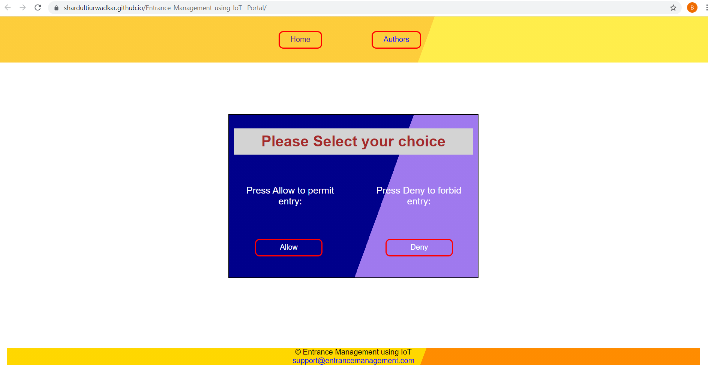
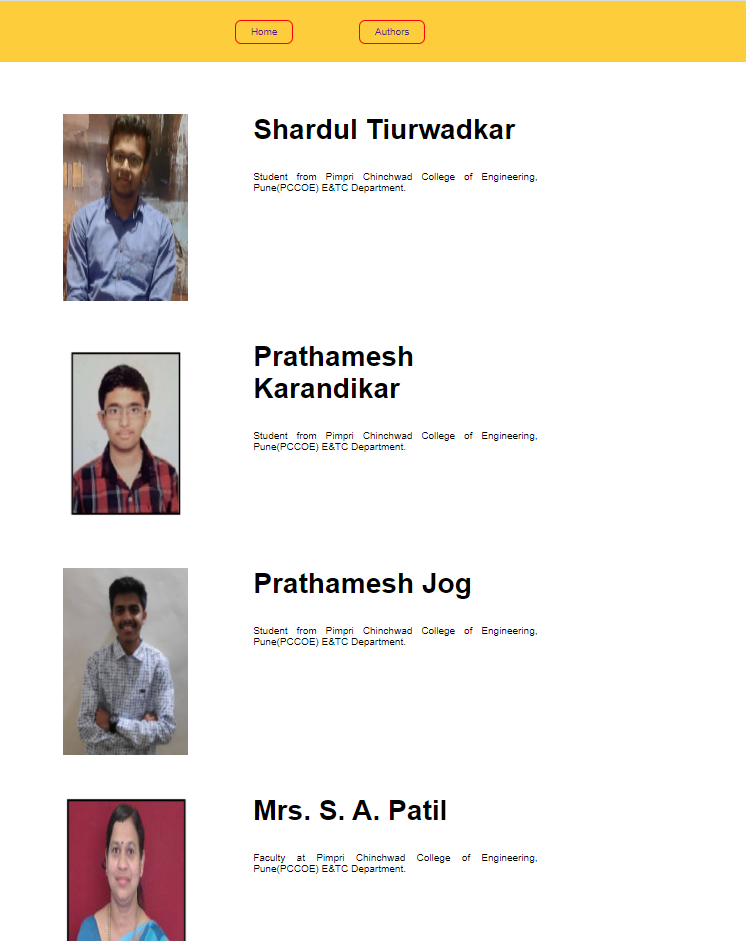

# Entrance-Management-using-IoT--Portal  
  
 WEBSITE LINK: https://shardultiurwadkar.github.io/Entrance-Management-using-IoT--Portal/index.html  
 
  
   This repository is about the Web Portal used to Allow or Deny the entry of the guest. Whenever owner of the flat clicks on the link from mail, it will redirect to this website and he will get 2 options that is either to allow or deny entry.
  
   The following screenshot shows index page of the web portal. We also added Authers page where one can see the authors.
     
   

     
   
     
   
